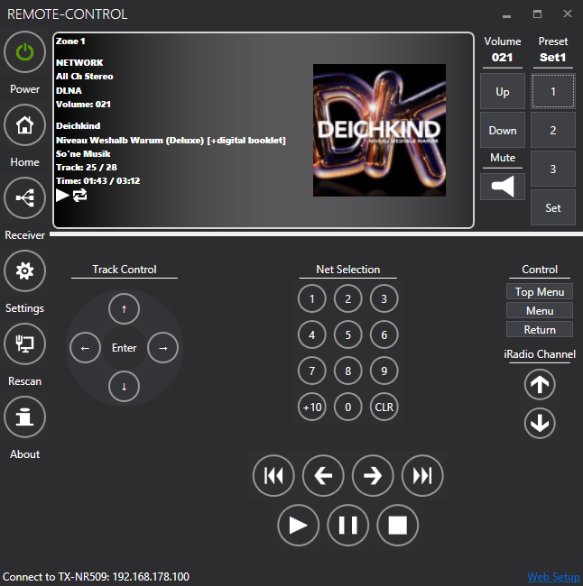
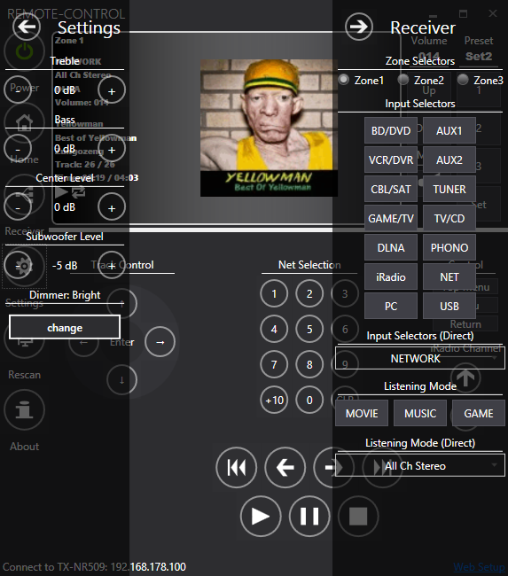
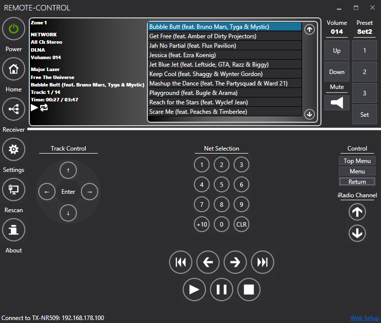

# NOnkyo
**Version > 0.13 NET Framework 4.5 needed**
This is a library and a GUI to communicate with Onkyo AV receivers over the network.

The library uses eISCP (Integra Serial Control Protocol over Ethernet) to control the receivers over an ethernet network connection.

If you would like to make a donation, please click the "Donate" button below.
 

## Features
* Auto Detect receiver
* Control volume and mute
* Tuner selection
* OSD Control
* Chose input selector and listening mode
* Net resources
* Show title, album and artwork
* Zone support
* Audiocontrol like bass or treble
* 3 presets to save and restore audio settings (volume, treble, bass, center lvl and subwoofer lvl)
* Provide a minimal REST-Api with a web-interface 
## Not implemented yet
* Speaker level
* Commands via RIHD
* Universal port commands
* CD / DVD Player commands
## Detail
The Application is build with Visual Studio 2012 (VS 2010 Solution) and target .NET Framework 4.5.
Logging is performed via [NLog](http://nlog.codeplex.com/). By Default there is no logging configuration file defined.
To enable logging copy a NLog.config file to the Exe Folder.
I use [LightCore](http://lightcore.ch) as IoC container. There is a command line arguments "FAKE" which init the IoC container with Fake classes.
The GUI is a WPF-Application (my very first) and is designed with [MahApps.Metro](http://mahapps.com/MahApps.Metro).
## Remarks
The project is only tested with **Onkyo TX-NR509** receiver.
Users have reported that the program also works with following receivers:
* TX-NR709
* TX-NR414
* TX-8050
* TX-NR818
* TX-NR515
* TX-NR525
* TX-NR929
## Screenshot

